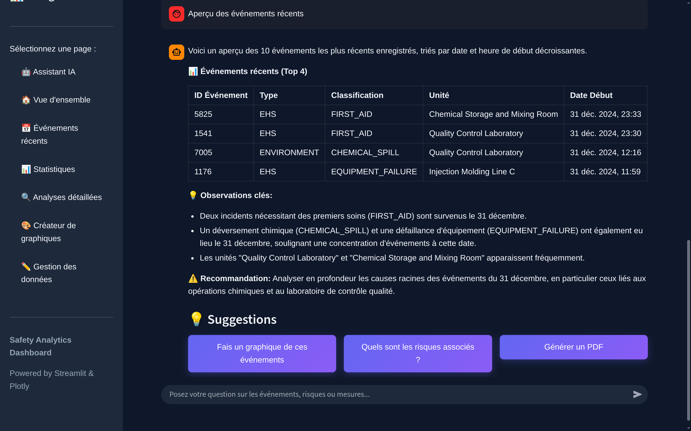
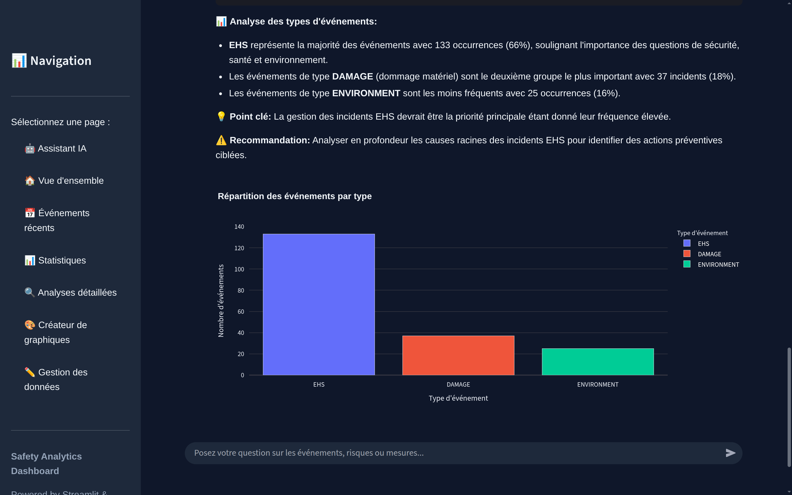
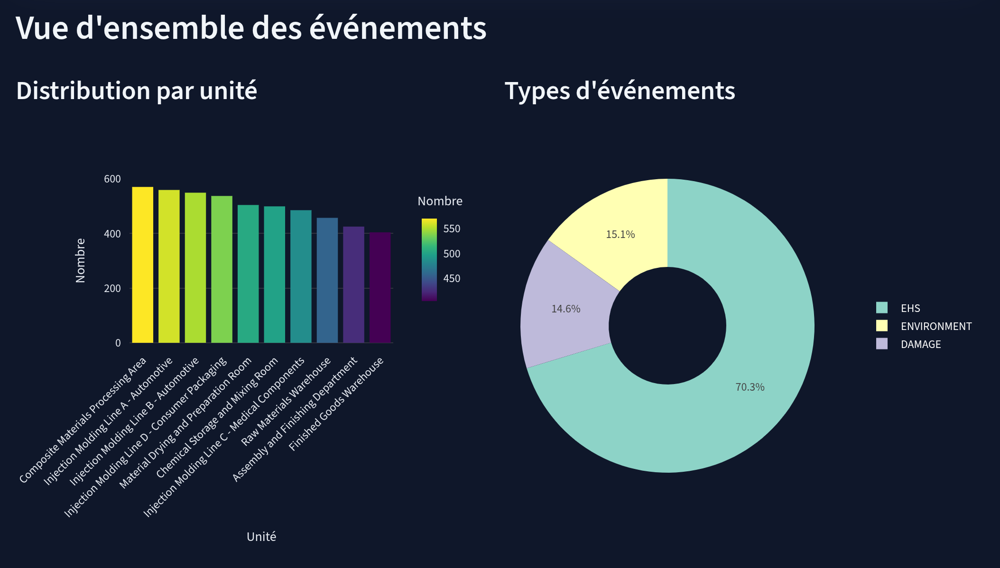
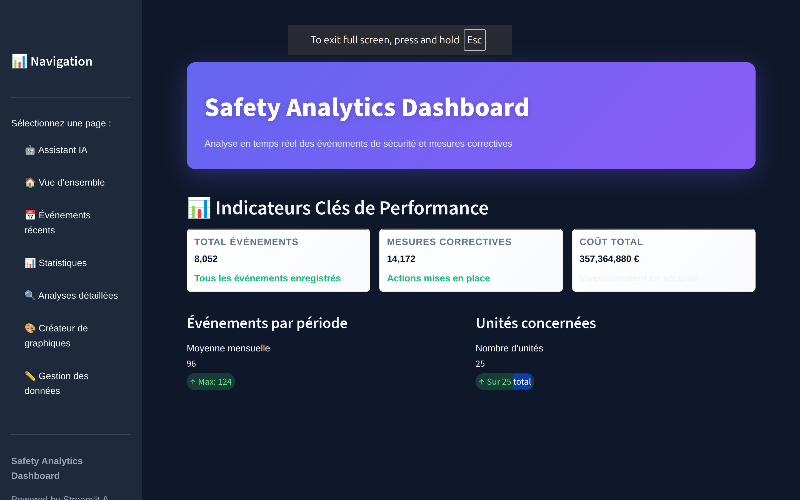
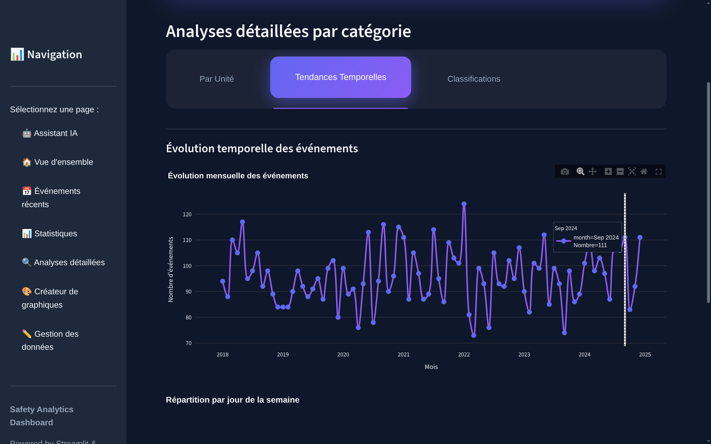

# 🛡️ Intelligent RAG Chatbot & Dashboard


**Expert Assistant for Event, Risk, and Corrective Action Management**

An intelligent conversational system combining a **RAG (Retrieval-Augmented Generation)** chatbot and an **interactive dashboard**. Query a PostgreSQL database using natural language, just like talking to an expert colleague — or explore your data visually.

> 🏆 This project won **second place** and **$1000 CAD** at the hackathon, developed after more than **25 hours of continuous coding**.

---

## ✨ Main Features

- 🧠 **Automatic SQL Generation** — Ask your questions in natural language.  
- 💬 **Conversational Interface** — Human-like tone, structured answers.  
- 📊 **Interactive Dashboard** — A connected dashboard with pre-built graphs and the ability to customize your own charts.  
- 🔍 **Total Transparency** — View the generated SQL and verifiable data.  
- 🛡️ **Robust Security** — Anti-SQL injection, automatic validation.  
- 🚀 **Simple Deployment** — All-in-one Docker setup.  

---

## 💬 Chatbot Preview




---

## 📊 Dashboard & Visualization

### Explore Data Visually

- Access the connected dashboard to view **pre-built analytics** on events, costs, and risks.  
- Create and **customize your own graphs** to discover new insights.  






---

## 🧠 What You Can Do

### Ask Natural Language Questions

Examples:
- "What are the recent events?"
- "List high-severity risks"
- "Who are the people involved in event 5?"
- "What is the total cost of corrective measures?"


The chatbot understands your question, automatically generates the appropriate SQL, and provides a clear, structured answer.

---

## 📂 PDF & Data Management


---

## 🚀 Quick Install (3 Steps)

### 🧩 Prerequisites
- **Docker** and **Docker Compose** installed → [Docker Desktop](https://www.docker.com/products/docker-desktop)  
- **Google Gemini API Key** → [Get one here](https://makersuite.google.com/app/apikey)

---

### ⚙️ Steps

#### 1️⃣ Configure the API Key
```bash
cd backend/app
cp .env.example .env
nano .env  # or vim, code, etc.
```

Add your API key to the `.env` file:

GEMINI_API_KEY=your_api_key_here

#### 2️⃣ Start the Services
```
cd ../..
docker-compose up -d
```

#### 3️⃣ Access the App

Open your browser to: **http://localhost:8501**


## Available Services

| Service | URL | Description |
|---------|-----|-------------|
| **Chatbot** | http://localhost:8501 | Streamlit conversational & visual interface |
| **API** | http://localhost:8000 | FastAPI REST backend |
| **API Docs** | http://localhost:8000/docs | Interactive Swagger documentation |
| **PostgreSQL** | localhost:5432 | Database |

## Example Questions

### Simple Questions
- "What are the recent events?"
- "List the identified risks"
- "How many events are recorded?"

### Relational Questions (Automatic JOINs)
- "Who are the people involved in event 5?"
- "Which events have critical risks associated with them?"
- "List the corrective measures with their owners"


### Analytical Questions
- "What is the total cost of corrective measures?"
- "How many events per type?"
- "Which unit has the most events?"


## How It Works

### Intelligent RAG Architecture

```
Question → SQL Generator → PostgreSQL → Data Retriever → Gemini LLM → Answer
```

1. **You ask a question in natural language.
2. **Gemini generates SQL adapted to your question.
3. **The system retrieves data from PostgreSQL.
4. **Gemini analyzes and structures a clear response.
5. **You receive a conversational answer** with tables and details.

### Total Transparency

With every answer, you can:
- See the automatically generated SQL
- Consult the raw data retrieved
- Understand the query's logic

## Security
- Automatic anti-SQL injection
- Only SELECT queries allowed
- Validation of all queries
- Result limiting (max 50 rows)


## Useful Docker Commands

-   **Start the environment:**
    ```bash
    docker compose up
    ```

-   **Stop and remove containers:**
    ```bash
    docker compose down
    ```

-   **Force a database reset:**
    If you want the database restore script to run again, remove the data volume. **Warning: This erases all DB data.**
    ```bash
    docker compose down -v
    ```

-   **View logs for a specific service:**
    ```bash
    # Database logs
    docker compose logs -f rag_db
    
    # Backend logs
    docker compose logs -f rag_backend
    ```

## Project Structure

neuils-de-utbm/
├── backend/
│   ├── app/
│   │   └── main.py          # FastAPI backend
│   ├── requirements.txt     # Python dependencies
│   └── Dockerfile           # Backend Dockerfile
│
├── db_backup/
│   ├── 02-restore.sh        # Script restoring backup
│   └── events.backup        # Database backup file
│
├── docker-compose.yml       # Orchestration file
└── README.md                # This file

## Conclusion

**Neuils-de-UTBM** est votre assistant intelligent pour la gestion d'événements, risques et mesures correctives.

### Points Forts
- **Conversational Interface** — Speak naturally
- **Automatic SQL** — No technical skills required
- **Interactive Dashboard** — Pre-built graphs and customization
- **Total Transparency** — Understand every answer
- **Simple Deployment** — 3 steps to get started

### Quick Start
1️⃣ Configure `.env` with your Gemini API key   
2️⃣ Run: `docker-compose up -d`   
3️⃣ Open http://localhost:8501   
4️⃣ Ask your questions!    

**Ready to use. Intelligent. Conversational.** 


---

*Developed for the Conformit X UQAC Hackathon 2025*
